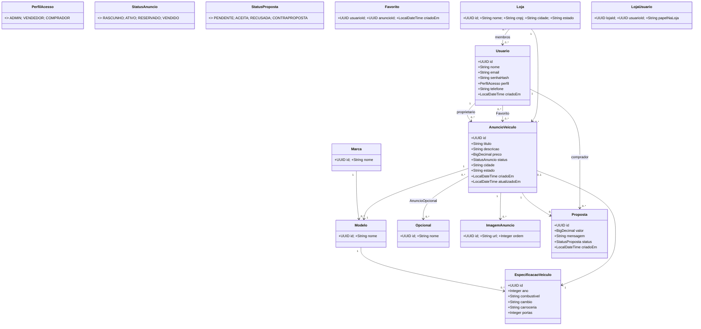
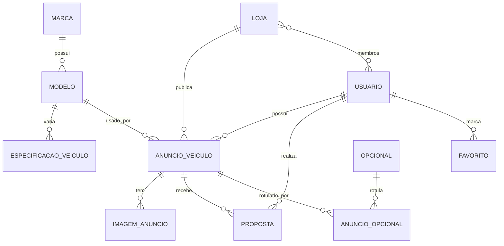

# UniMotors – Documento de Análise

> **Tema:** Backend Spring Boot 3 (JWT, JPA, Flyway, PostgreSQL) inspirado no case WebMotors.  
> **Escrito por:** Guilherme José Goncalves, Dionathan Tomaz e Allan Correa.

---

## 0) Sumário
- [1) Nome e Propósito](#1-nome-e-propósito)
- [2) Equipe e Responsabilidades](#2-equipe-e-responsabilidades)
- [3) Requisitos](#3-requisitos)
- [4) Arquitetura & Pacotes](#4-arquitetura--pacotes)
- [5) Modelagem (UML – classes)](#5-modelagem-uml)
- [6) DER (Modelo Entidade‑Relacionamento)](#6-der-modelo-entidade-relacionamento)
- [7) Regras de Negócio](#7-regras-de-negócio)
- [8) DTOs e Validações (exemplos)](#8-dtos-e-validações-exemplos)
- [9) Endpoints REST (rotas)](#9-endpoints-rest-rotas)
- [10) Tratamento Centralizado de Exceções](#10-tratamento-centralizado-de-exceções)
- [11) Segurança (JWT) – Esqueleto](#11-segurança-jwt--esqueleto)
- [12) Banco de Dados – Flyway V1__init.sql](#12-banco-de-dados--flyway-v1__initsql)

---

## 1) Nome e Propósito
**Nome do sistema:** **UniMotors**  
**Propósito:** marketplace de veículos (carros e motos) onde **vendedores** (particulares/lojas) publicam **anúncios** e **compradores** pesquisam, **fazem propostas** e negociam. Foco em catálogo (Marca/Modelo/Especificação), anúncios ricos (imagens e opcionais), busca filtrável e fluxo de **propostas** com autenticação **JWT**.

---

## 2) Equipe e Responsabilidades

- **Dev Guilherme (SM) – Usuários & Autenticação**  
  Entidades: `Usuario`, `PerfilAcesso (enum)`  
  Fluxos: registro, login (JWT), refresh, CRUD (ADMIN).  
  Regras: e‑mail único, senha com **hash**, autorização por papel.

- **Dev Allan – Anúncios**  
  Entidades: `AnuncioVeiculo`, `ImagemAnuncio`, `AnuncioOpcional (join)`  
  Fluxos: CRUD do próprio anúncio; estados: **RASCUNHO/ATIVO/RESERVADO/VENDIDO**.  
  Regras: preço > 0, imagem obrigatória para ATIVO, só dono edita.

  Entidades: `Marca`, `Modelo`, `EspecificacaoVeiculo`, `Opcional`  
  Regras: `Modelo` pertence a `Marca`; seed inicial via Flyway.

- **Dev Dionathan – Negócios e Testes**  
  Entidades: `Proposta`, `Favorito`  
  Fluxos: enviar proposta, aceitar/recusar, favoritos.  
  Regras: aceitar proposta muda status do anúncio; favorito único por usuário+anúncio.

  Entidades: `Loja`, `LojaUsuario`  
  Fluxos: CRUD loja, vínculo de vendedores à loja, anúncios por loja.

---

## 3) Requisitos
### 3.1 Funcionais (mínimos + extras)
1. CRUD completo de **5+ entidades** (`Usuario`, `Marca`, `Modelo`, `AnuncioVeiculo`, `Proposta` …)  
2. Relacionamentos **1:N** (Marca→Modelo, Anuncio→Imagem, Usuario→Anuncio, Anuncio→Proposta) e **N:N** (Anuncio↔Opcional, Loja↔Usuario).  
3. **JWT** (autenticação + autorização por `PerfilAcesso`).  
4. **Validações** (`@NotBlank`, `@Email`, `@Positive`, `@Size` …).  
5. **Exceções centralizadas** (`@ControllerAdvice`).  
6. **DTOs** para entrada/saída (não expor entidades).  
7. **(Bônus)** logs SLF4J em ações importantes (login, publicar anúncio, aceitar proposta).

### 3.2 Não‑funcionais
- Spring Boot 3+, Spring Data JPA, Spring Security, JWT, Lombok.  
- PostgreSQL 12–17.  
- Flyway (migrations versionadas).  
- Swagger/OpenAPI + README.  
- Paginação e ordenação (`Pageable`), CORS habilitado.  
- Mensagens de erro padronizadas (i18n opcional).

---

## 4) Arquitetura & Pacotes
```
br.com.unimotors
 ├─ config/                 (segurança, swagger, cors)
 ├─ autenticacao/           (JWT, filtro, AuthController)
 ├─ usuario/                (Usuario, PerfilAcesso, DTOs, serviço, repositório)
 ├─ catalogo/               (Marca, Modelo, EspecificacaoVeiculo, Opcional)
 ├─ anuncio/                (AnuncioVeiculo, ImagemAnuncio, AnuncioOpcional)
 ├─ negocio/                (Proposta, Favorito, Loja, LojaUsuario)
 ├─ comum/                  (exceções, handlers, BaseEntity, utils)
 └─ infra/                  (armazenamento de imagens, e‑mail, etc.)
```
**Perfis de acesso**  
`ADMIN` (administração geral) · `VENDEDOR` (CRUD dos **próprios** anúncios, gerencia propostas recebidas) · `COMPRADOR` (buscar, favoritar, enviar propostas).

---

## 5) Modelagem (UML)


---

## 6) DER (Modelo Entidade‑Relacionamento)


### Tabelas (resumo)
- `usuarios` (id PK, email UNIQUE, perfil, …)  
- `lojas`, `lojas_usuarios` (N:N opcional)  
- `marcas`, `modelos (brand_id)`, `especificacoes_veiculo (model_id)`  
- `opcionais`  
- `anuncios` (owner_id, loja_id, modelo_id, especificacao_id, status, …)  
- `imagens_anuncio`  
- `anuncios_opcionais (ad_id, opcional_id)`  
- `propostas` (ad_id, comprador_id, status)  
- `favoritos (usuario_id, anuncio_id)`

Índices úteis: `idx_anuncios_status`, `idx_anuncios_preco`, `idx_anuncios_cidade_estado`, `idx_modelos_marca`, `idx_propostas_anuncio`, `idx_favoritos_usuario`.

---

## 7) Regras de Negócio
- **Anúncio**: `ATIVO` exige `preco > 0` e ≥ 1 imagem; apenas **proprietário** (ou `ADMIN`) edita; `ACEITAR` proposta → anúncio `RESERVADO` (ou `VENDIDO` se concluído).  
- **Propostas**: comprador não propõe no próprio anúncio; ao aceitar uma proposta, **outras pendentes** do mesmo anúncio podem ser **marcadas como RECUSADA** automaticamente.  
- **Favoritos**: único por `(usuario, anuncio)` (PK composta).  
- **Catálogo**: `Modelo` pertence a `Marca`; `EspecificacaoVeiculo` detalha ano/combustível/câmbio/…

---

## 8) DTOs e Validações (exemplos)
```java
// pacote: br.com.unimotors.autenticacao.dto
public record RegistroDTO(
  @jakarta.validation.constraints.NotBlank String nome,
  @jakarta.validation.constraints.Email String email,
  @jakarta.validation.constraints.Size(min=8, max=64) String senha,
  @jakarta.validation.constraints.NotNull br.com.unimotors.usuario.model.PerfilAcesso perfil
) {}

public record LoginDTO(
  @jakarta.validation.constraints.Email String email,
  @jakarta.validation.constraints.NotBlank String senha
) {}

public record TokenRespostaDTO(String tokenAcesso, String tokenRefresh) {}
```
```java
// pacote: br.com.unimotors.anuncio.dto
public record AnuncioCriarDTO(
  java.util.UUID modeloId,
  java.util.UUID especificacaoId,
  @jakarta.validation.constraints.NotBlank String titulo,
  @jakarta.validation.constraints.Size(max=4000) String descricao,
  @jakarta.validation.constraints.Positive java.math.BigDecimal preco,
  @jakarta.validation.constraints.NotBlank String cidade,
  @jakarta.validation.constraints.NotBlank String estado,
  java.util.Set<java.util.UUID> opcionaisIds,
  java.util.List<@jakarta.validation.constraints.NotBlank String> urlsImagens
) {}

public record AnuncioRespostaDTO(
  java.util.UUID id,
  String titulo,
  String descricao,
  java.math.BigDecimal preco,
  String status,
  String cidade,
  String estado,
  String marca,
  String modelo,
  Integer ano,
  java.util.List<String> imagens,
  java.util.Set<String> opcionais,
  java.util.UUID proprietarioId
) {}
```
```java
// pacote: br.com.unimotors.negocio.dto
public record PropostaCriarDTO(
  @jakarta.validation.constraints.Positive java.math.BigDecimal valor,
  @jakarta.validation.constraints.Size(max=500) String mensagem
) {}

public record PropostaRespostaDTO(
  java.util.UUID id,
  java.util.UUID anuncioId,
  java.util.UUID compradorId,
  java.math.BigDecimal valor,
  String status,
  java.time.LocalDateTime criadoEm
) {}
```

---

## 9) Endpoints REST
**Autenticação**  
`POST /api/autenticacao/registrar` – cria usuário  
`POST /api/autenticacao/login` – retorna JWT  
`POST /api/autenticacao/atualizar-token` – refresh

**Catálogo**  
`GET /api/marcas` · `POST /api/marcas` (ADMIN)  
`GET /api/marcas/{id}/modelos`  
`GET /api/modelos/{id}/especificacoes`  
`GET /api/opcionais` · `POST /api/opcionais` (ADMIN)

**Anúncios**  
`GET /api/anuncios?marca=...&modelo=...&precoMin=...&cidade=...&page=...`  
`GET /api/anuncios/{id}`  
`POST /api/anuncios` (VENDEDOR/ADMIN)  
`PUT /api/anuncios/{id}` (proprietário/ADMIN)  
`PATCH /api/anuncios/{id}/status` (proprietário/ADMIN)  
`DELETE /api/anuncios/{id}` (proprietário/ADMIN)

**Imagens**  
`POST /api/anuncios/{id}/imagens` (lista de URLs ou upload)  
`DELETE /api/anuncios/{id}/imagens/{imagemId}`

**Propostas**  
`POST /api/anuncios/{id}/propostas` (COMPRADOR)  
`GET /api/anuncios/{id}/propostas` (proprietário/ADMIN)  
`PATCH /api/propostas/{propostaId}/aceitar` (proprietário/ADMIN)  
`PATCH /api/propostas/{propostaId}/recusar` (proprietário/ADMIN)

**Favoritos**  
`POST /api/anuncios/{id}/favoritos`  
`DELETE /api/anuncios/{id}/favoritos`  
`GET /api/meus/favoritos`

---

## 10) Tratamento Centralizado de Exceções
```java
// pacote: br.com.unimotors.comum.excecao
@org.springframework.web.bind.annotation.RestControllerAdvice
public class TratamentoExcecoesGlobal {

  @org.springframework.web.bind.annotation.ExceptionHandler(jakarta.validation.ConstraintViolationException.class)
  @org.springframework.http.HttpStatusCodeException
  public org.springframework.http.ResponseEntity<?> handleValidacao(jakarta.validation.ConstraintViolationException ex,
                                                                   jakarta.servlet.http.HttpServletRequest request) {
    var body = java.util.Map.of(
      "timestamp", java.time.OffsetDateTime.now().toString(),
      "status", 400,
      "erro", "Requisição inválida",
      "mensagem", ex.getMessage(),
      "caminho", request.getRequestURI()
    );
    return org.springframework.http.ResponseEntity.badRequest().body(body);
  }

  @org.springframework.web.bind.annotation.ExceptionHandler(javax.persistence.EntityNotFoundException.class)
  public org.springframework.http.ResponseEntity<?> handleNaoEncontrado(javax.persistence.EntityNotFoundException ex,
                                                                       jakarta.servlet.http.HttpServletRequest request) {
    var body = java.util.Map.of(
      "timestamp", java.time.OffsetDateTime.now().toString(),
      "status", 404,
      "erro", "Recurso não encontrado",
      "mensagem", ex.getMessage(),
      "caminho", request.getRequestURI()
    );
    return org.springframework.http.ResponseEntity.status(404).body(body);
  }

  // Sugestão: criar BusinessException e AccessDenied handlers…
}
```

---

## 11) Segurança (JWT) – Esqueleto
```java
// pacote: br.com.unimotors.config
@Configuration
@EnableMethodSecurity
public class ConfiguracaoSeguranca {

  @Bean
  public SecurityFilterChain filtro(HttpSecurity http, FiltroJwt filtroJwt) throws Exception {
    http
      .csrf(csrf -> csrf.disable())
      .sessionManagement(sm -> sm.sessionCreationPolicy(SessionCreationPolicy.STATELESS))
      .authorizeHttpRequests(auth -> auth
        .requestMatchers("/api/autenticacao/**", "/swagger-ui/**", "/v3/api-docs/**").permitAll()
        .anyRequest().authenticated()
      )
      .addFilterBefore(filtroJwt, UsernamePasswordAuthenticationFilter.class);
    return http.build();
  }
}
```
```java
// pacote: br.com.unimotors.autenticacao.jwt
@Component
public class TokenJwtService {
  @Value("${app.jwt.segredo}") private String segredo;
  @Value("${app.jwt.expMinutos:60}") private long expMinutos;

  public String gerarToken(String subject, java.util.Collection<String> papeis) {
    var agora = java.time.Instant.now();
    return io.jsonwebtoken.Jwts.builder()
      .setSubject(subject)
      .claim("roles", papeis)
      .setIssuedAt(java.util.Date.from(agora))
      .setExpiration(java.util.Date.from(agora.plus(java.time.Duration.ofMinutes(expMinutos))))
      .signWith(io.jsonwebtoken.security.Keys.hmacShaKeyFor(segredo.getBytes()), io.jsonwebtoken.SignatureAlgorithm.HS256)
      .compact();
  }

  public io.jsonwebtoken.Claims validar(String token) {
    return io.jsonwebtoken.Jwts.parserBuilder()
      .setSigningKey(segredo.getBytes())
      .build()
      .parseClaimsJws(token)
      .getBody();
  }
}
```
```java
// pacote: br.com.unimotors.autenticacao.jwt
@Component
public class FiltroJwt extends OncePerRequestFilter {
  private final TokenJwtService tokens;
  private final UsuarioService usuarios;

  public FiltroJwt(TokenJwtService tokens, UsuarioService usuarios) {
    this.tokens = tokens; this.usuarios = usuarios;
  }

  @Override
  protected void doFilterInternal(HttpServletRequest req, HttpServletResponse res, FilterChain chain)
      throws ServletException, IOException {
    var auth = req.getHeader("Authorization");
    if (auth != null && auth.startsWith("Bearer ")) {
      var jwt = auth.substring(7);
      var claims = tokens.validar(jwt);
      var email = claims.getSubject();
      var detalhes = usuarios.carregarPorEmail(email); // UserDetails
      var autenticado = new UsernamePasswordAuthenticationToken(detalhes, null, detalhes.getAuthorities());
      SecurityContextHolder.getContext().setAuthentication(autenticado);
    }
    chain.doFilter(req, res);
  }
}
```

---

## 12) Banco de Dados – Flyway `V1__init.sql`
> **Observação:** usa `UUID` e enums como `TEXT` com `CHECK`.

```sql
-- V1__init.sql
CREATE EXTENSION IF NOT EXISTS "uuid-ossp";

-- USUÁRIOS
CREATE TABLE usuarios (
  id UUID PRIMARY KEY DEFAULT uuid_generate_v4(),
  nome VARCHAR(120) NOT NULL,
  email VARCHAR(180) NOT NULL UNIQUE,
  senha_hash VARCHAR(255) NOT NULL,
  perfil VARCHAR(16) NOT NULL CHECK (perfil IN ('ADMIN','VENDEDOR','COMPRADOR')),
  telefone VARCHAR(20),
  criado_em TIMESTAMP NOT NULL DEFAULT NOW()
);

-- LOJAS (opcional)
CREATE TABLE lojas (
  id UUID PRIMARY KEY DEFAULT uuid_generate_v4(),
  nome VARCHAR(160) NOT NULL,
  cnpj VARCHAR(18) UNIQUE,
  cidade VARCHAR(80) NOT NULL,
  estado VARCHAR(2) NOT NULL
);

CREATE TABLE lojas_usuarios (
  loja_id UUID NOT NULL REFERENCES lojas(id) ON DELETE CASCADE,
  usuario_id UUID NOT NULL REFERENCES usuarios(id) ON DELETE CASCADE,
  papel_na_loja VARCHAR(30),
  PRIMARY KEY (loja_id, usuario_id)
);

-- CATÁLOGO
CREATE TABLE marcas (
  id UUID PRIMARY KEY DEFAULT uuid_generate_v4(),
  nome VARCHAR(100) NOT NULL UNIQUE
);

CREATE TABLE modelos (
  id UUID PRIMARY KEY DEFAULT uuid_generate_v4(),
  marca_id UUID NOT NULL REFERENCES marcas(id) ON DELETE RESTRICT,
  nome VARCHAR(120) NOT NULL,
  CONSTRAINT uq_modelo UNIQUE (marca_id, nome)
);

CREATE TABLE especificacoes_veiculo (
  id UUID PRIMARY KEY DEFAULT uuid_generate_v4(),
  modelo_id UUID NOT NULL REFERENCES modelos(id) ON DELETE CASCADE,
  ano INT CHECK (ano >= 1950 AND ano <= EXTRACT(YEAR FROM NOW()) + 1),
  combustivel VARCHAR(20),
  cambio VARCHAR(20),
  carroceria VARCHAR(30),
  portas INT CHECK (portas BETWEEN 1 AND 6)
);

CREATE TABLE opcionais (
  id UUID PRIMARY KEY DEFAULT uuid_generate_v4(),
  nome VARCHAR(80) NOT NULL UNIQUE
);

-- ANÚNCIOS
CREATE TABLE anuncios (
  id UUID PRIMARY KEY DEFAULT uuid_generate_v4(),
  proprietario_id UUID NOT NULL REFERENCES usuarios(id) ON DELETE CASCADE,
  loja_id UUID REFERENCES lojas(id) ON DELETE SET NULL,
  modelo_id UUID NOT NULL REFERENCES modelos(id) ON DELETE RESTRICT,
  especificacao_id UUID REFERENCES especificacoes_veiculo(id) ON DELETE SET NULL,
  titulo VARCHAR(140) NOT NULL,
  descricao TEXT,
  preco NUMERIC(12,2) NOT NULL CHECK (preco > 0),
  status VARCHAR(12) NOT NULL CHECK (status IN ('RASCUNHO','ATIVO','RESERVADO','VENDIDO')),
  cidade VARCHAR(80) NOT NULL,
  estado VARCHAR(2) NOT NULL,
  criado_em TIMESTAMP NOT NULL DEFAULT NOW(),
  atualizado_em TIMESTAMP NOT NULL DEFAULT NOW()
);

CREATE INDEX idx_anuncios_status ON anuncios(status);
CREATE INDEX idx_anuncios_preco ON anuncios(preco);
CREATE INDEX idx_anuncios_cidade_estado ON anuncios(cidade, estado);

CREATE TABLE imagens_anuncio (
  id UUID PRIMARY KEY DEFAULT uuid_generate_v4(),
  anuncio_id UUID NOT NULL REFERENCES anuncios(id) ON DELETE CASCADE,
  url TEXT NOT NULL,
  ordem INT DEFAULT 0
);

CREATE TABLE anuncios_opcionais (
  anuncio_id UUID NOT NULL REFERENCES anuncios(id) ON DELETE CASCADE,
  opcional_id UUID NOT NULL REFERENCES opcionais(id) ON DELETE RESTRICT,
  PRIMARY KEY (anuncio_id, opcional_id)
);

-- PROPOSTAS
CREATE TABLE propostas (
  id UUID PRIMARY KEY DEFAULT uuid_generate_v4(),
  anuncio_id UUID NOT NULL REFERENCES anuncios(id) ON DELETE CASCADE,
  comprador_id UUID NOT NULL REFERENCES usuarios(id) ON DELETE CASCADE,
  valor NUMERIC(12,2) NOT NULL CHECK (valor > 0),
  mensagem VARCHAR(500),
  status VARCHAR(16) NOT NULL DEFAULT 'PENDENTE' CHECK (status IN ('PENDENTE','ACEITA','RECUSADA','CONTRAPROPOSTA')),
  criado_em TIMESTAMP NOT NULL DEFAULT NOW()
);
CREATE INDEX idx_propostas_anuncio ON propostas(anuncio_id);
CREATE INDEX idx_propostas_comprador ON propostas(comprador_id);

-- FAVORITOS
CREATE TABLE favoritos (
  usuario_id UUID NOT NULL REFERENCES usuarios(id) ON DELETE CASCADE,
  anuncio_id UUID NOT NULL REFERENCES anuncios(id) ON DELETE CASCADE,
  criado_em TIMESTAMP NOT NULL DEFAULT NOW(),
  PRIMARY KEY (usuario_id, anuncio_id)
);
```

> **Seed opcional (V0__seed_catalog.sql):** inserir algumas `marcas`, `modelos` e `opcionais` para testes.

---